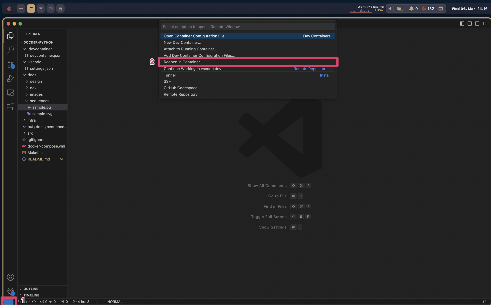
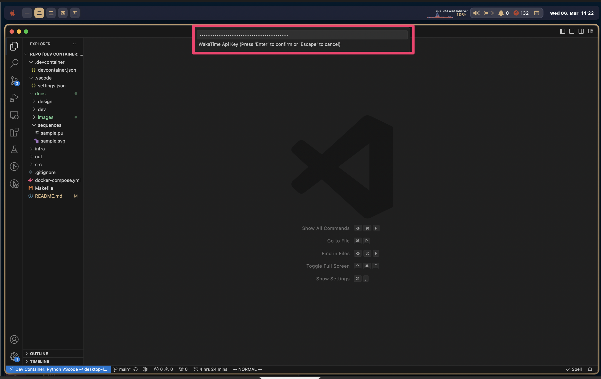

# docker-python-handson
This is a my own broiler template for python.
- [docker-python-handson](#docker-python-handson)
    - [docker commands](#docker-commands)
    - [start](#start)
    - [containers](#containers)
    - [vscode settings](#vscode-settings)

### docker commands
```bash
# run as production (docker-compose up -d --build)
$ make up
# run as develop (docker-compose -f docker-compose-dev.yml up -d --build)
$ make dev
# get into a container (docker-compose exec python bash)
$ make python
# down (docker-compose down)
$ make down
# destroy (docker-compose down --rmi all --volumes --remove-orphans)
$ make destroy
```

### start
1. run container
```bash
$ make up
```
2. reopen in container in vscode


3. set up [WakaTime](https://wakatime.com/) API key ([link](https://wakatime.com/settings/api-key))


4. copy `src/common/config/config.template.ini` to `src/common/config/config.ini`
```bash
cp src/common/config/config.template.ini src/common/config/config.ini
cp src/common/config/config.template.ini src/common/config/config.dev.ini
```

### containers
- python
  - python container to exec
- vscode
  - for dev containers in vscode
- plantuml
  - for sequences


### vscode settings
How do I press and hold a key and have it repeat in VSCode?
```bash
$ defaults write com.microsoft.VSCode ApplePressAndHoldEnabled -bool false
```
