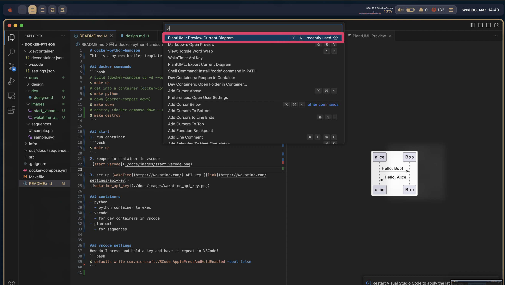
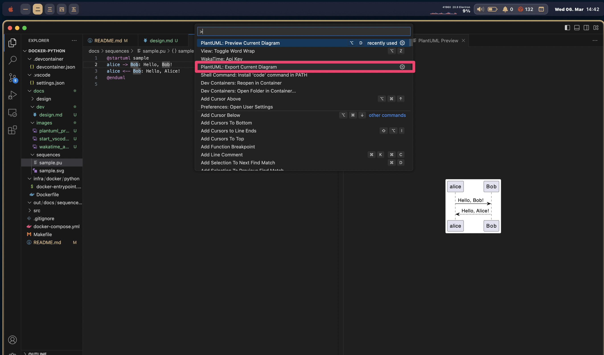

# design
- [design](#design)
  - [sequences](#sequences)
    - [preview current sequence](#preview-current-sequence)
    - [export current sequence](#export-current-sequence)
    - [errors](#errors)

## sequences
you can use `plantuml` to make sequence not in dev container

### preview current sequence


### export current sequence


### errors
`No valid diagram found here!`
> As mentioned here, try to put the cursor somewhere between `@startuml` and `@enduml`, and then press `ALT + D` to open the preview. If the cursor is outside of the `@startuml @enduml` block, the "No valid diagrams found here!" error occurs.

[ref](https://github.com/qjebbs/vscode-plantuml/issues/140#issuecomment-870400917)

## Sphinx
```bash
sphinx-quickstart ../docs/sphinx
```
